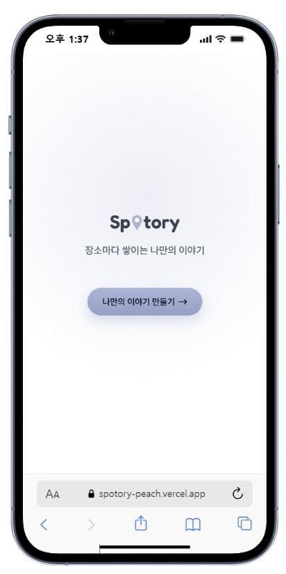
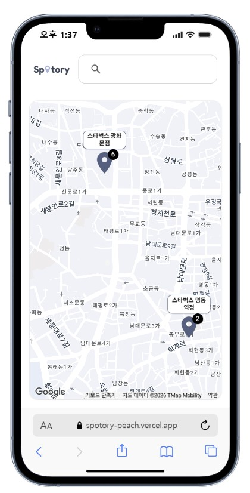
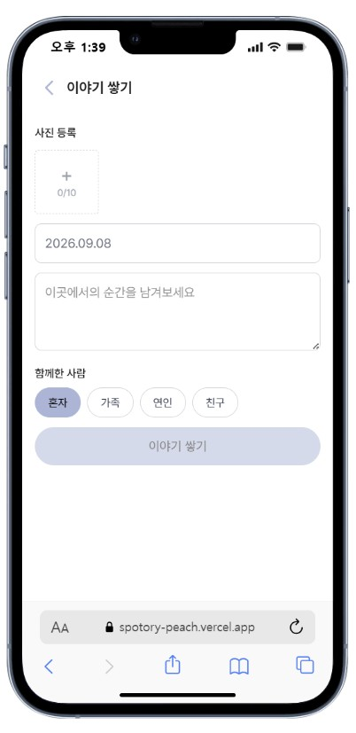
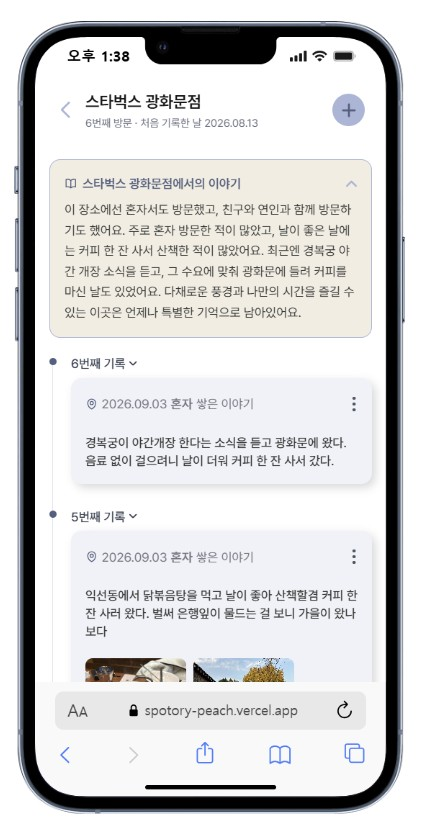
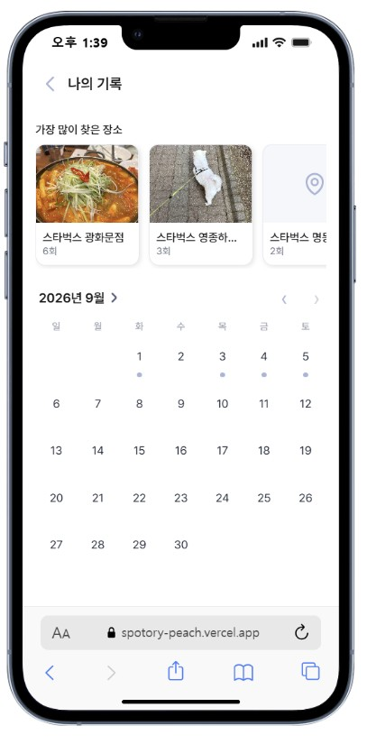
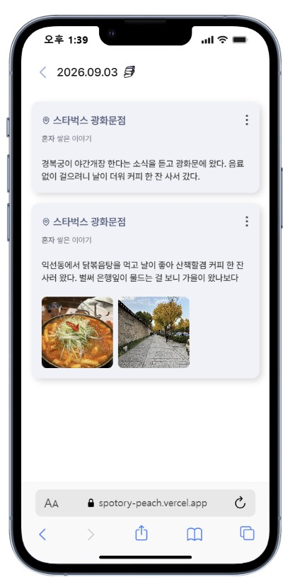
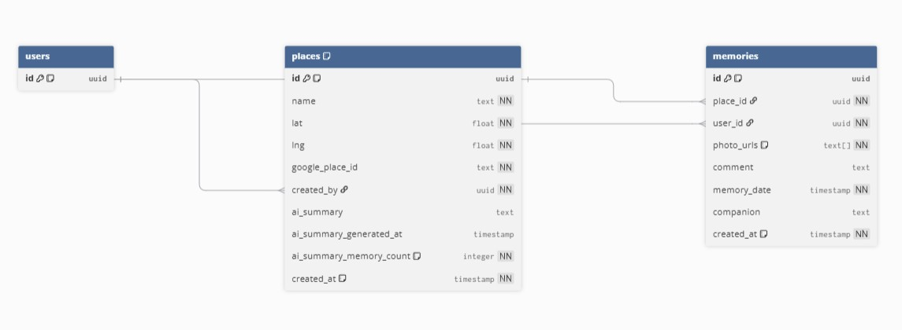

# Spotory

> "장소마다 쌓인 순간들이 시간이 지나면 하나의 이야기가 된다"

**[🔗 Spotory](https://spotory-peach.vercel.app)**

## 목차

1. [프로젝트 소개](#프로젝트-소개)
2. [개발 기간](#개발-기간)
3. [스크린샷](#스크린샷)
4. [주요 기능](#주요-기능)
5. [기술 스택](#기술-스택)
6. [프로젝트 구조](#프로젝트-구조)
7. [데이터 모델](#데이터-모델)
8. [ERD](#erd)
9. [기술적 의사결정 / 트러블슈팅](#기술적-의사결정--트러블슈팅)
10. [향후 개선 사항](#향후-개선-사항)

## 프로젝트 소개

Spotory는 **Spot(장소)** 과 **Story(이야기)** 를 합친 이름의 개인 기록 서비스입니다.

장소는 기록을 분류하는 태그가 아니라 기록이 쌓이는 하나의 단위입니다. 같은 장소를 다시 방문할 때마다 남긴 사진과 코멘트는 그 장소에 차곡차곡 더해지고 기록이 3개 이상 쌓이면 AI가 그동안의 방문을 하나의 이야기로 요약해줍니다.

사진 한 장과 짧은 코멘트만으로 20초 내외에 기록을 남길 수 있는 가벼운 로그형 UX를 통해 부담 없이 지속할 수 있는 개인 기록 습관을 유도하는 것을 목표로 합니다.

## 개발 기간

**2026.08.12 ~ 2026.09.06 (총 4주) · 1인 개발**

| 주차 | 내용 |
|---|---|
| 1주차 | 프로젝트 셋업, Supabase 연동, 이메일 인증, 라우팅 가드, DB 스키마 설계 |
| 2주차 | 지도 렌더링, 장소 검색/마커, 기록 CRUD(사진·날짜·코멘트·동행인), 이미지 업로드 |
| 3주차 | AI 장소 요약, 달력 기반 타임라인, 장소별 기록 상세, 가장 많이 찾은 장소, 지도-기록 상태 동기화 |
| 4주차 | 반응형/완성도 작업, 코드 정리, Vercel 배포 및 배포 후 버그 수정 |

## 스크린샷

|  |  |  |  |
|:---:|:---:|:---:|:---:|
| <sub>스플래시 화면</sub> | <sub>스플래시 화면</sub> | <sub>지도 화면</sub> | <sub>기록 작성 페이지</sub> |

|  |  |  |
|:---:|:---:|:---:|
| <sub>기록 상세 페이지</sub> | <sub>나의 기록 페이지</sub> | <sub>날짜별 기록 페이지</sub> |

## 주요 기능

- **지도** — Google Maps 기반 지도, 장소 검색(자동완성 + 현재 위치 편향), 마커 클러스터링, 마커에 기록 개수 뱃지 표시. 위치 권한을 허용하면 현재 위치, 거부하면 마지막으로 기록을 남긴 장소를 기준으로 지도가 열림
- **기록(memory) CRUD** — 사진 다중 첨부, 날짜, 코멘트, 동행인 입력 / 수정 / 삭제, 마지막 기록 삭제 시 장소 자동 정리
- **장소 상세 타임라인** — 한 장소에 쌓인 모든 기록을 최신순으로 열람
- **나의 기록 보기** — 달력으로 날짜별 기록 탐색, 가장 많이 찾은 장소 Top 3
- **AI 장소 요약** — 기록이 3개 이상 쌓인 장소부터 GPT-4o-mini가 방문 패턴을 2~3문장으로 요약. 이후 기록이 2개씩 늘어날 때마다 새로 생성해 갱신하고, 그 사이엔 캐싱된 요약을 그대로 보여줌. 기록을 삭제해 개수가 줄어들면 바로 갱신
- **인증** — Supabase Auth 이메일 회원가입/로그인, 로그인 상태 기반 라우팅 가드
- **공유** — 링크 공유 시 로고 썸네일(OG 이미지) 노출

## 기술 스택

| 분류 | 툴 |
| --- | --- |
| **프론트엔드** |     |
| **백엔드・DB** |  |
| **API** |   |
| **배포** |  |

## 프로젝트 구조

```
src/
├── app/
│   ├── page.tsx                     # 스플래시 화면
│   ├── home/                        # 로그인 후 메인 메뉴
│   ├── login/                       # 로그인 / 회원가입
│   ├── auth/callback/               # Supabase Auth 콜백
│   ├── map/                         # 지도 홈 (검색, 마커)
│   ├── places/[placeId]/            # 장소 상세 타임라인
│   ├── places/[placeId]/new/        # 새 장소에 첫 기록 작성
│   ├── memories/[memoryId]/edit/    # 기록 수정
│   ├── timeline/                    # 나의 기록 보기 (달력 + Top 장소)
│   ├── timeline/[date]/             # 특정 날짜 기록 상세
│   ├── api/story/                   # AI 장소 요약 생성 API
│   ├── opengraph-image.tsx          # 링크 공유 미리보기 이미지
│   └── icon.tsx                     # 파비콘
├── components/
│   ├── map/                         # 지도, 마커, 검색 오버레이
│   ├── memory/                      # 기록 폼, 카드, 타임라인 아이템
│   ├── timeline/                    # 달력, 연/월 선택, Top 장소
│   ├── icons/                       # 공용 아이콘 컴포넌트
│   └── ui/                          # 버튼, 다이얼로그 등 공용 UI
├── hooks/                           # 장소 목록, 지도 초기 좌표 훅
├── lib/
│   ├── google/                      # Google Maps SDK 로더
│   ├── supabase/                    # Supabase 클라이언트 (서버/클라이언트)
│   ├── format/                      # 동행인·한글 조사 포맷팅
│   ├── image/                       # 업로드 전 이미지 압축
│   └── theme.ts                     # 공용 색상 상수
├── types/                           # 도메인 타입, DB 타입
└── proxy.ts                         # 인증 라우팅 가드 미들웨어

supabase/
└── migrations/                      # DB 스키마 마이그레이션
```

## 데이터 모델

- `places(id, name, lat, lng, google_place_id, created_by, ai_summary, ai_summary_generated_at, ai_summary_memory_count)`
- `memories(id, place_id, user_id, photo_urls, comment, memory_date, companion, created_at)`
- `(created_by, google_place_id)` 유니크 인덱스로 동일 장소 재검색 시 중복 생성 방지
- RLS로 본인이 만든 장소/기록만 조회 가능

## ERD



- `USERS`는 Supabase Auth가 관리하는 `auth.users` 테이블입니다.
- `PLACES.google_place_id`는 `created_by`와 묶어 유니크 인덱스를 걸어, 같은 사용자가 같은 장소를 두 번 저장하지 못하게 합니다.
- `MEMORIES`가 삭제되어 특정 장소의 기록이 0개가 되면 해당 `PLACES` 행도 함께 삭제됩니다.

## 기술적 의사결정 / 트러블슈팅

**동일 장소 중복 저장 방지**
같은 장소를 상호명과 도로명 주소 등 다르게 검색하면 구글이 서로 다른 결과를 줄 수 있어, 좌표·이름만으로 저장하면 같은 장소가 여러 행으로 쪼개질 위험이 있었다. 물리적 장소마다 고유한 구글의 `place_id`를 별도 컬럼(`google_place_id`)으로 저장하고 `(created_by, google_place_id)` 유니크 인덱스에 `upsert`를 걸어, 이미 저장된 장소면 기존 행을 그대로 재사용하도록 했다.

**뒤로가기 시 방금 제출한 폼이 다시 보이는 문제**
기록 작성/수정 성공 후 서버 액션에서 `redirect()`로 이동시켰더니, 브라우저 히스토리에 폼 제출 요청이 그대로 남아 뒤로가기를 누르면 방금 제출한 폼 화면이 다시 나타났다. 서버 `redirect()` 대신 클라이언트에서 `router.back()`(기존 장소) / `router.replace()`(새 장소)로 이동시키는 방식으로 바꿔 해결했다.

**마지막 기록을 삭제해도 지도에 마커가 남는 문제**
기록만 지우고 장소(`places`) 행은 그대로 두는 구조라, 한 장소의 마지막 기록을 지워도 지도엔 빈 마커가 계속 남아 있었다. 기록 삭제 후 해당 장소에 남은 기록 수를 다시 세어, 0개면 장소 행도 함께 삭제하도록 했다.

**위치 권한을 허용해도 지도가 이동하지 않는 문제**
`getCurrentPosition`의 타임아웃이 브라우저 권한 팝업에 응답을 기다리는 시간까지 포함해서 흘러가, 사용자가 팝업을 확인하고 누르는 사이에 요청이 먼저 타임아웃 나버리는 경우가 있었다. 타임아웃을 여유 있게 늘려 해결했다.

## 향후 개선 사항

- 지역별 카테고리 보기
- 사람 필터 (함께한 사람별 기록 보기)
- 예전 오늘 (n년 전 오늘 기록 노출)
